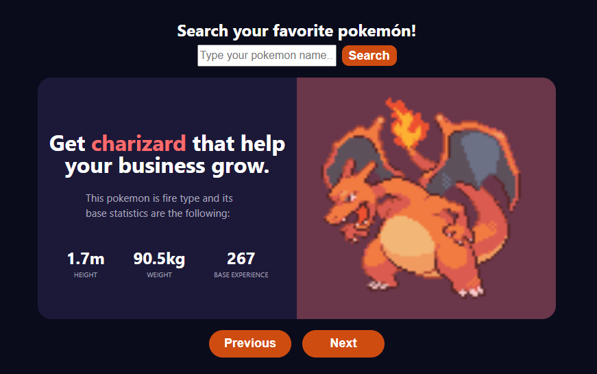
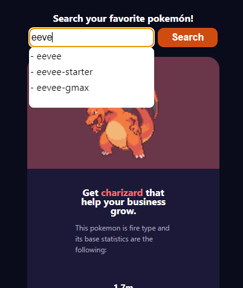

# Titulo App 

## Table of Contents
1. [General Info](#general-info)
2. [Requisitos Previos](#requisitos-previos)
3. [Configuracion Inicial](#configuración-inicial)
4. [Ejecutar la aplicacion](#ejecutar-la-aplicación)
5. []()
6. []()
#

## **General Info**

La aplicación de pokedex es una sencilla pero poderosa herramienta desarrollada con Yarn, React JS y Vite. Su objetivo principal es mostrar información detallada sobre los Pokémon, permitiéndote explorar sus características y detalles específicos como altura, peso y experiencia base. La informacion de estos pokemons es extraida de la API PokeApi, aqui les dejo el enlace: [PokeApi](https://pokeapi.co/).

La aplicación cuenta con un diseño totalmente responsivo, lo que garantiza una experiencia óptima en dispositivos de diferentes tamaños, desde computadoras de escritorio hasta teléfonos móviles.


#

## **Requisitos Previos**

- **Node.js:** Asegúrate de tener Node.js instalado en tu sistema. Puedes descargarlo desde https://nodejs.org.

- **Yarn:** Asegúrate de tener Yarn instalado en tu sistema. Puedes encontrar instrucciones de instalación en https://yarnpkg.com.
#

## **Configuración Inicial**

1. Clona o descarga este repositorio.
```
git clone https://github.com/https://github.com/Cristiap17/pruebaIGlobal.git
```

2. Navega hasta el directorio del proyecto en tu terminal.
```
cd nombre-repositorio
```

3. Ejecuta el siguiente comando para instalar las dependencias necesarias:

```
yarn install
````
#

## **Ejecutar la aplicación**

1. Después de completar la configuración inicial, ejecuta el siguiente comando para iniciar la aplicación:

```
yarn dev
```


## **Uso de la aplicación**
- Al abrir la aplicación, en la pantalla inicial una card donde se encontrara la informacion del primer pokemon en la lista de los 1281 pokemon con los que cuenta la API PokéApi.

    Adicionalmente, la vista cuenta con bos botones "Next" el cual avanza al siguiente pokemon en la lista, y "Previous" el cual lleva al pokemon anterior a la lista. 


- El color del pokemon en turno, define el color de su fondo y el color de su nombre dependiendo el tipo de pokemon que sea, ejemplo: Grass, Watter, Fire... Etc.



- Cuenta con un buscador en la parte superior el cual te llevara directamente tu pokemon favorito si este existe dentro de la lista de pokemon de la PokeAPI.
    Este buscador cuenta con 3 funcionalidades las cuales son:

    1. Si el campo de texto se encuentra vacío éste no dejara hacer ninguna busqueda y aparecera un mensaje de error.

    2. Si el nombre del pokemon deseado no existe, saldra un mensaje de error.
    
    3. Al momento de escribir cualquier letra sobre el campo de texo, automaticamente aprecera un Dropdown el cual contendra sugerencias de nombres de pokemon dependiendo de las letras que se vayan ingresando sobre el campo de texto.





¡Disfruta usando la aplicación de Pokedex! Si tienes alguna pregunta o problema, no dudes en consultar la documentación o [contactar al desarrollador](https://www.linkedin.com/in/cristian-pineda17/).

